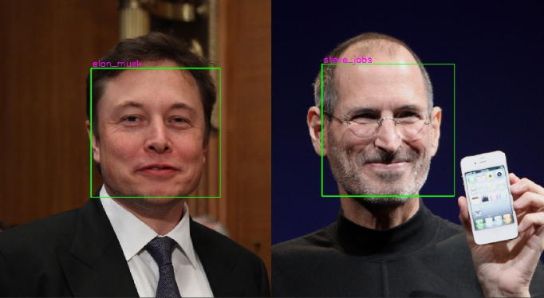

## Face recognition using FaceNet model

### Introduction
Face recognition using Neural Network. Neural Network is implemented using [Keras](https://keras.io/) functional API, that makes it easy to experiment with different architectures. The input of Neural Network is 128 dimensional vector. Haar Cascade has been used to detect faces.


### Model
Pretrained FaceNet model has been used to generate 128-D vector embedding and neural network was built on with two hidden layers to classify names.

### Installation 

First of all, you need to check if you have all required packages to launch the jupyter notebook. If not then install requirements.

```sh
$ git clone https://github.com/Elmar999/face-recognition-using-FaceNet-model.git
$ pip3 install -r requirements.txt
```

If you want to train with your own custom images, you have to prepare your own dataset in train_images folder.

```sh
|-face-recognition-using-FaceNet-model
    |-train_images
        |- Person1
            |- img1
            |- img2
            ....
        |- Person2
            |- img1
            |- img2
            ....
        ....
```

### Result 


